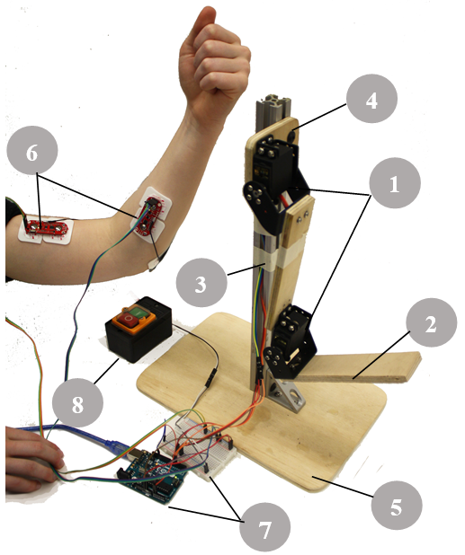

# Neupulator

The use of human-interactive robots in industry and daily life has become more prevalent throughout society as more people are using collaborative, and assistive robots to accomplish a task. To demonstrate the utility and importance of assistive robots to middle school students, a unique educational platform called Neu-pulator (neurally-controlled manipulator) was designed and fabricated to introduce their application in improving the quality of life. This robotic manipulator consists of low-cost components, which reflect the characteristics of a human arm, and is actuated by signals from the student’s neuromuscular system. During summer 2016, a 5-day program introduced students to the engineering design process as they designed, programmed, manufactured, and tested the Neu-pulator robot.  A series of surveys and group interviews were performed to understand how each student’s attitude and opinion towards different STEM-related topics evolved throughout the course, both quantitatively and qualitatively. We observed that the student’s confidence, attitude, and excitement towards STEM improved over the course of the week, especially when they could see the robot they developed in action. With the use of this unique educational platform, a bridge can be made from learning fundamental engineering and STEM materials to ‘real-world’ application of human interactive and assistive robots.

**Fig.1)**  Assembly of the Neu-pulator. (1) “Shoulder” and “Elbow” servomotor joints, (2) Wooden “Arm” Linkages, (3) T-slot Aluminum Frame, (4) “Shoulder Blade” Adapter, (5) Base Plate, (6) EMG Sensors, (7) Arduino and Breadboard, (8) Safety Power Switch

**Fig.2)** Robotic Arm Reaching Challenge. Neupulator must controlled via the EMG sensors to touch the runner robot in the shortest time.

## Content

| File | Description |
| ---  | ---	     |
| `Arduino/emg_game` | Game to track a reference signal displayed on the Serial Plotter using an EMG signal reading your muscles activity |
| `Arduino/linearAlgebraIK` | Controls the runner robot, a 4DOF manipulator, to execute the Robotic Arm Reaching Challenge. |
| `Arduino/syp2dofRobot2` | Controls the neupulator, reading 2 EMG sensors and commanding 2 servo motors. |

## References

These resources are based on the following papers. Please cite the appropriate papers when using this material or parts of it in an academic publication.

Knop, Lauren, Saeedeh Ziaeefard, Guilherme A. Ribeiro, Brian R. Page, Evandro Ficanha, Michele H. Miller, Mo Rastgaar, and Nina Mahmoudian. "A human-interactive robotic program for middle school stem education." In 2017 IEEE Frontiers in Education Conference (FIE), pp. 1-7. IEEE, 2017.